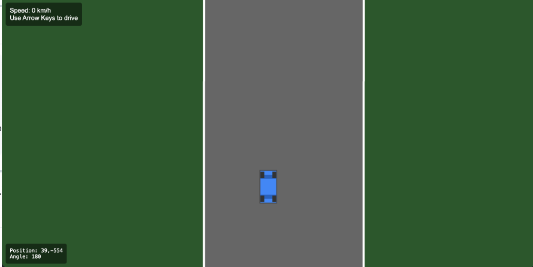

# 🏎️ Racing Game Prototype

## 🚧 Work in Progress
This is currently a prototype implementing Phase 1 - Step 1 of a larger racing game project. The prototype focuses on core car physics and movement mechanics. This project is built entirely with vanilla JavaScript and was developed using AI assistance.

---

<video controls src="race.mp4" title="Title"></video>

---



---

## 🎮 Current Features
- Top-down car physics with realistic momentum
- Front-wheel drive mechanics
- Visual effects:
  - Car tilt during turns
  - Wheel steering animation
  - Acceleration glow
  - Tire marks during sharp turns
- Dynamic camera that follows the car
- Debug UI showing speed, position, and angle

## 🎯 Development Roadmap

### Phase 1: Core Game Mechanics
- ✅ Car Movement System (current)
- ⏳ Track System & Collision Detection
- ⏳ AI Neural Network Implementation
- ⏳ UI Components

### Phase 2: Multiplayer Integration
- ⏳ WebSocket Server Setup
- ⏳ Real-time Player Sync
- ⏳ Lobby System
- ⏳ Leaderboards & Trophies

## 🚀 Planned Features

### Single-Player
- Hand-drawn SVG tracks
- Bounding box collision detection
- Lap counting & finish line detection
- AI opponents using neural networks
- Environmental effects (rain, motion blur)
- Mini-map with car positions

### Multiplayer (Future)
- WebSocket-based real-time gameplay
- Track rotation every 2 minutes
- Pre-lobby chat system
- Race leaderboards (daily, weekly, all-time)
- Trophy system for winners
- Real-time AI training persistence

## 🎯 Controls
- **↑** - Accelerate
- **↓** - Brake/Reverse
- **←** - Turn Left
- **→** - Turn Right

## 🛠️ Technical Details
- Pure Vanilla JavaScript (No frameworks/libraries)
- HTML5 Canvas for rendering
- Vite for development server
- AI-assisted development
- Physics-based car movement
- Advanced camera system with smooth following

## 🚀 Getting Started
1. Clone the repository
```bash
git clone https://github.com/firstpixel/RacingGame.git
cd RacingGame
```

2. Install dependencies
```bash
npm install
```

3. Run development server
```bash
npm run dev
```

4. Open your browser to `http://localhost:3000`

## 🏗️ Project Structure
```
/racing-game 
├── client/ 
│ └── src/ 
│ ├── game/ 
│ │ ├── Car.js # Car physics and rendering 
│ │ ├── Camera.js # Camera following system 
│ │ └── Game.js # Main game controller 
│ ├── effects/ │ │ └── VisualEffects.js # Tire marks and effects 
│ ├── index.html # Game entry point 
│ └── main.js # Game initialization 
├── package.json # Project configuration 
├── vite.config.js # Vite build configuration 
└── README.md # Project documentation
```

## 📝 Current Status
Currently implementing Phase 1 - Step 1:
- ✅ Basic car physics
- ✅ Front-wheel drive mechanics
- ✅ Camera system
- ✅ Visual effects
- ⏳ Track collision
- ⏳ AI implementation

## 🤖 AI Development
This project is being developed with AI assistance, using:
- GitHub Copilot for code generation
- AI-assisted design patterns
- AI-optimized physics calculations
- Machine learning preparation for future AI opponents

## 🔨 Development Philosophy
- Pure vanilla JavaScript for better understanding and control
- Physics-based movement for realistic feel
- Modular design for easy feature addition
- Performance-focused implementation
- AI-assisted but human-reviewed code

## 📜 License
MIT License - Feel free to use this code for learning purposes.

## 🤝 Contributing
As this is a prototype in active development, please open an issue first to discuss what you would like to change.

## 🙏 Acknowledgments
- Developed with AI assistance
- Inspired by classic top-down racing games
- Community feedback and contributions